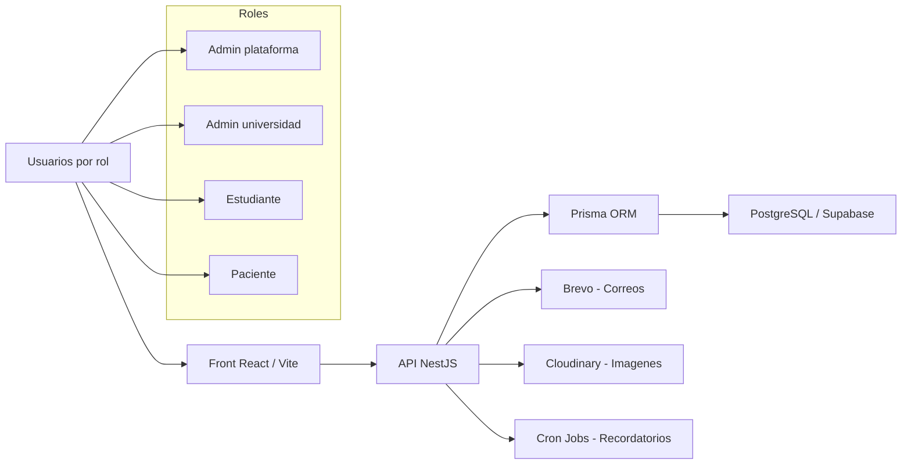

# Docqee - Analisis funcional y tecnico

Fecha de analisis: 30 de abril de 2026  
Alcance: este documento describe el funcionamiento completo observado en el codigo actual de `Front` y `Back`, incluyendo modulos, roles, flujos principales, arquitectura, base de datos, seguridad, operacion y riesgos tecnicos.

## 1. Resumen ejecutivo

Docqee es una plataforma web orientada a conectar pacientes con estudiantes de salud vinculados a universidades. La aplicacion administra el ciclo completo: vinculacion institucional, creacion de universidades, administracion de estudiantes y docentes, publicacion de perfiles profesionales, busqueda de estudiantes por parte de pacientes, solicitudes de atencion, conversaciones, agendamiento de citas, reprogramaciones, finalizacion de citas y valoraciones entre usuarios.

El sistema esta dividido en dos aplicaciones principales:

- `Front`: aplicacion React con Vite, TypeScript y Tailwind CSS.
- `Back`: API NestJS con Prisma como ORM, PostgreSQL/Supabase como base de datos, autenticacion JWT, bcrypt para contrasenas, Brevo para correos transaccionales y Cloudinary para imagenes.

La logica de negocio esta organizada alrededor de cuatro roles:

- `ADMIN_PLATAFORMA`: administra universidades, credenciales iniciales y estado institucional.
- `ADMIN_UNIVERSIDAD`: administra informacion institucional, estudiantes, docentes, sedes y credenciales de estudiantes.
- `ESTUDIANTE`: configura su perfil, tratamientos, sedes, agenda, solicitudes, conversaciones, citas y valoraciones.
- `PACIENTE`: se registra con verificacion de correo, busca estudiantes, envia solicitudes, conversa, gestiona citas y valora atenciones.

En terminos funcionales, la aplicacion ya cubre el flujo operativo principal de inicio a fin. En terminos tecnicos, se apoya en stores personalizados del frontend para evitar recargas innecesarias, en endpoints separados por dominio y en un modelo relacional bastante completo. Los puntos mas delicados estan en seguridad de sesion, sincronizacion de migraciones/baseline con Supabase, rendimiento de consultas de directorio, pruebas E2E y mantenimiento de ciertos bloques de codigo historico.

## 2. Vision general de arquitectura



La aplicacion esta construida como una SPA en el frontend y una API modular en el backend. El frontend consume los endpoints mediante un cliente HTTP centralizado que adjunta el token de acceso, intenta refrescar la sesion ante errores de autenticacion y mantiene datos del modulo en stores externos. El backend valida datos con DTOs y `ValidationPipe`, protege endpoints con JWT y delega persistencia a Prisma.

## 3. Tecnologias principales

### Frontend

- React 18.
- Vite.
- TypeScript.
- Tailwind CSS.
- Lucide React para iconografia.
- `xlsx` para carga masiva desde archivos Excel.
- Vitest como base de pruebas.
- Stores personalizados con `useSyncExternalStore`.
- Persistencia de sesion en `localStorage`.

### Backend

- NestJS 11.
- Prisma 6.
- PostgreSQL/Supabase.
- JWT y Passport.
- bcrypt para hash de contrasenas y codigos.
- Brevo para correos transaccionales.
- Cloudinary para imagenes de perfil y logos institucionales.
- `@nestjs/schedule` para tareas automaticas.
- `class-validator` y `class-transformer` para validacion.

## 4. Estructura del repositorio

```text
Docqee/
  Back/
    prisma/
      schema.prisma
      seed.ts
      migrations/
    src/
      app.module.ts
      main.ts
      modules/
      shared/
      config/
  Front/
    src/
      app/
      components/
      constants/
      lib/
      pages/
      types/
  package.json
  vercel.json
```

El repositorio separa claramente el frontend y backend. La raiz contiene scripts de build que delegan en cada subproyecto. El backend concentra migraciones, esquema Prisma y seed. El frontend concentra rutas, paginas, stores, cliente API, constantes y componentes.

## 5. Autenticacion y ciclo de sesion

El login se realiza contra `/auth/login`. El backend valida el correo y la contrasena con bcrypt, hidrata la relacion correspondiente al rol y genera tokens de acceso y refresco.

El frontend guarda la sesion en `localStorage` bajo la clave `docqee.auth-session`. El `AuthProvider` valida la sesion almacenada contra `/auth/me`, sincroniza cambios entre pestanas y limpia stores de modulo cuando cambia el dueno de la sesion. Esto evita que datos de una cuenta queden mezclados con otra despues de cerrar sesion o iniciar con un usuario diferente.

El cliente API agrega `Authorization: Bearer <token>` en las peticiones protegidas. Si recibe `401` o `403`, intenta refrescar la sesion con `/auth/refresh`, actualiza el almacenamiento local y repite la peticion cuando corresponde.

La aplicacion redirige al usuario segun su rol:

- Paciente: `/paciente/buscar-estudiantes`.
- Admin plataforma: `/admin/universidades`.
- Estudiante: `/estudiante/inicio`.
- Admin universidad: `/universidad/inicio`.

Para estudiantes y administradores de universidad existe un flujo de primer ingreso: cuando `requiresPasswordChange` esta activo, se fuerza la ruta `/primer-ingreso/cambiar-contrasena` antes de permitir la navegacion normal.

## 6. Registro, verificacion y recuperacion de cuenta

El registro de pacientes no crea inmediatamente la cuenta definitiva. Primero se guarda una solicitud pendiente en `registro_paciente_pendiente`, con los datos personales serializados, hash del codigo de verificacion y fecha de expiracion. Solo cuando el paciente confirma el codigo en `/auth/verify-email`, el backend crea:

- `persona`.
- `cuenta_acceso`.
- `cuenta_paciente`.
- `tutor_responsable`, si aplica por edad.

Este enfoque evita que queden cuentas reales creadas sin haber verificado el correo. Tambien mejora el flujo cuando el usuario abandona la verificacion, porque el correo puede volver a registrarse si la verificacion no se completa y el pendiente expira o se reemplaza.

La recuperacion de contrasena usa `recuperacion_cuenta`, codigos de seis digitos con hash bcrypt y expiracion corta. El flujo se compone de:

- Solicitar codigo.
- Verificar codigo.
- Cambiar contrasena.

Los catalogos de registro, como tipos de documento, ciudades y localidades, se consultan desde base de datos mediante `/catalogs`, por lo que el frontend no deberia depender de listas quemadas para esos datos.

## 7. Modulo publico

El modulo publico cubre la experiencia antes de iniciar sesion:

- Pagina de inicio.
- Login.
- Registro de paciente.
- Verificacion de correo.
- Cambio de contrasena de primer ingreso.
- Recuperacion de contrasena.
- Politica de privacidad.
- Terminos y condiciones.
- Solicitud de vinculacion institucional.

La solicitud de vinculacion institucional se envia por correo usando Brevo hacia la direccion configurada en `INSTITUTIONAL_PARTNERSHIP_EMAIL`. Este flujo permite que una universidad interesada contacte a la plataforma sin tener todavia usuario administrativo.

## 8. Modulo Admin Plataforma

Ruta base: `/admin`.

Este modulo administra el nivel superior de Docqee. Sus rutas principales son:

- `/admin/universidades`.
- `/admin/universidades/registrar`.
- `/admin/credenciales`.

### 8.1 Gestion de universidades

El administrador de plataforma puede listar universidades, registrar nuevas instituciones y cambiar su estado. Al crear una universidad, el backend crea tambien:

- Registro en `universidad`.
- Persona del administrador institucional.
- Cuenta de acceso del administrador de universidad.
- Registro en `cuenta_admin_universidad`.
- Credencial inicial pendiente en `credencial_inicial`.

El estado institucional afecta el acceso de su administrador y de su operacion. Si una universidad esta inactiva, el login del administrador universitario se bloquea.

### 8.2 Credenciales de universidades

En `/admin/credenciales`, el administrador de plataforma gestiona las credenciales iniciales de administradores universitarios. Puede:

- Ver credenciales pendientes.
- Editar el correo de una credencial.
- Enviar una credencial.
- Reenviar una credencial.
- Enviar todas las credenciales pendientes.
- Eliminar/anular una credencial.

Cuando se envia una credencial, el backend genera una contrasena temporal, guarda su hash, registra el envio en `envio_credencial` y envia el correo transaccional. El usuario receptor queda obligado a cambiar la contrasena en su primer ingreso.

## 9. Modulo Admin Universidad

Ruta base: `/universidad`.

Este modulo permite que una universidad administre su operacion interna. Sus rutas principales son:

- `/universidad/inicio`.
- `/universidad/informacion-institucional`.
- `/universidad/estudiantes`.
- `/universidad/estudiantes/registrar`.
- `/universidad/docentes`.
- `/universidad/docentes/registrar`.
- `/universidad/carga-masiva`.
- `/universidad/credenciales`.

### 9.1 Inicio institucional

El inicio muestra un resumen operativo con indicadores de estudiantes, docentes, sedes y actividad reciente. Esta pantalla funciona como tablero de seguimiento para que el administrador tenga visibilidad rapida del estado de su universidad.

### 9.2 Informacion institucional

El administrador puede editar datos institucionales y de su propio usuario:

- Nombre de la universidad.
- Nombres y apellidos del administrador.
- Correo y telefono.
- Ciudad/localidad principal.
- Logo institucional.
- Sedes de atencion.
- Contrasena.

Las sedes se sincronizan contra la base de datos. El logo se carga por Cloudinary y queda asociado a la universidad.

### 9.3 Gestion de estudiantes

El administrador puede listar, crear y activar/inactivar estudiantes. Al crear un estudiante se registran:

- Datos personales en `persona`.
- Cuenta en `cuenta_acceso` con tipo `ESTUDIANTE`.
- Relacion en `cuenta_estudiante`.
- Credencial inicial pendiente.

El sistema valida duplicados por correo y documento. Los estudiantes creados por universidad quedan asociados a esa institucion y luego pueden completar su perfil profesional desde el modulo de estudiante.

### 9.4 Gestion de docentes

Los docentes se administran por universidad, pero el modelo permite que una persona docente exista de forma global y se vincule a una o varias universidades mediante `docente_universidad`. Esto evita duplicar identidades de docentes cuando participan en diferentes instituciones.

El administrador puede crear docentes, listarlos y activar/inactivar su vinculacion.

### 9.5 Carga masiva

La carga masiva usa archivos Excel. El frontend lee el archivo con `xlsx`, valida filas y envia datos al backend. El backend tiene rutas separadas para carga masiva de estudiantes y docentes.

Este flujo es clave para operar universidades con muchos usuarios, porque evita registrar manualmente cada persona.

### 9.6 Credenciales de estudiantes

En `/universidad/credenciales`, el administrador gestiona credenciales iniciales de estudiantes. Puede:

- Ver credenciales pendientes.
- Editar correos antes de enviar.
- Enviar una credencial.
- Reenviar credenciales.
- Enviar todas.
- Eliminar/anular credenciales.

El comportamiento es equivalente al de credenciales de administradores universitarios, pero limitado a estudiantes de la universidad autenticada.

## 10. Modulo Estudiante

Ruta base: `/estudiante`.

Sus rutas principales son:

- `/estudiante/inicio`.
- `/estudiante/mi-perfil`.
- `/estudiante/agenda`.
- `/estudiante/citas`.
- `/estudiante/solicitudes`.
- `/estudiante/conversaciones`.
- `/estudiante/notificaciones` redirige al inicio.

### 10.1 Perfil del estudiante

El estudiante configura su presencia profesional:

- Foto de perfil.
- Descripcion profesional.
- Disponibilidad general.
- Enlaces profesionales.
- Tratamientos visibles.
- Sedes donde atiende.

Esta informacion alimenta directamente el directorio que ve el paciente en `/paciente/buscar-estudiantes`. Si el estudiante no completa tratamientos o sedes, su visibilidad puede quedar limitada, porque la busqueda exige criterios operativos activos.

### 10.2 Tratamientos y sedes

El estudiante selecciona los tipos de tratamiento que ofrece y las sedes de la universidad donde atiende. Estas relaciones se guardan en:

- `estudiante_tratamiento`.
- `estudiante_sede_practica`.

El backend permite activar o desactivar estas relaciones sin perder necesariamente el historico.

### 10.3 Agenda

El estudiante administra bloques de disponibilidad o bloqueo. Existen bloques especificos y recurrentes, con estado activo/inactivo. Estos bloques son usados para validar disponibilidad al crear, editar o reprogramar citas.

### 10.4 Solicitudes

El estudiante recibe solicitudes enviadas por pacientes. Puede:

- Ver datos del paciente.
- Ver perfil, puntaje y comentarios del paciente cuando existan valoraciones.
- Aceptar una solicitud.
- Rechazar una solicitud.
- Cerrar una solicitud ya aceptada.

Cuando una solicitud se acepta, el sistema crea o activa una conversacion entre paciente y estudiante. Cuando se cierra, la conversacion queda cerrada o no disponible para nuevos mensajes.

### 10.5 Conversaciones

Las conversaciones son privadas entre paciente y estudiante y dependen de una solicitud aceptada. El estudiante puede consultar conversaciones, abrir una conversacion concreta y enviar mensajes mientras la conversacion este activa.

### 10.6 Citas

El estudiante puede proponer citas al paciente dentro de una solicitud aceptada. El ciclo incluye:

- Crear propuesta.
- Editar propuesta antes de que sea aceptada.
- Reprogramar una cita aceptada.
- Cancelar una cita.
- Finalizar una cita despues de su hora de cierre.
- Valorar al paciente cuando la cita finaliza.

El backend valida solapamientos con otras citas, disponibilidad del estudiante, disponibilidad del paciente y reglas de tiempo para cancelar o reprogramar.

## 11. Modulo Paciente

Ruta base: `/paciente`.

Sus rutas principales son:

- `/paciente/inicio`.
- `/paciente/buscar-estudiantes`.
- `/paciente/solicitudes`.
- `/paciente/agenda`.
- `/paciente/conversaciones`.
- `/paciente/citas`.
- `/paciente/mi-perfil`.

### 11.1 Inicio del paciente

El inicio resume informacion relevante del paciente, como solicitudes, citas, conversaciones, valoraciones y datos principales de perfil. Sirve como punto de entrada al estado actual de su atencion.

### 11.2 Buscar estudiantes

Esta es una de las pantallas mas importantes de la aplicacion. El paciente puede buscar estudiantes por:

- Nombre.
- Tratamiento.
- Ciudad.
- Localidad.
- Universidad.

El backend usa una consulta optimizada para traer estudiantes activos, universidades activas, tratamientos activos, sedes activas, enlaces profesionales, promedio de valoraciones y comentarios. Si no hay filtros, se intenta priorizar relevancia por ciudad/localidad del paciente.

Al abrir el perfil de un estudiante, deben mostrarse:

- Foto del estudiante.
- Nombre y semestre.
- Estado de estudiante verificado.
- Universidad y logo institucional.
- Calificacion promedio en estrellas.
- Cantidad de resenas.
- Sedes donde atiende.
- Descripcion profesional.
- Disponibilidad general.
- Tratamientos visibles.
- Enlaces profesionales.
- Comentarios de valoraciones.
- Motivo de solicitud.
- Acciones para cancelar o enviar solicitud.

La tabla de estudiantes usa paginacion responsive y debe ocupar el espacio disponible sin recortar filas ni crear paginas innecesarias.

### 11.3 Solicitudes

El paciente puede enviar solicitudes a estudiantes y hacer seguimiento de sus estados. El sistema evita solicitudes activas duplicadas entre el mismo paciente y estudiante. Tambien puede reutilizar o cerrar flujos anteriores segun el estado historico.

Estados relevantes:

- Pendiente.
- Aceptada.
- Rechazada.
- Cancelada.
- Cerrada.

### 11.4 Conversaciones

Cuando un estudiante acepta una solicitud, se habilita una conversacion. El paciente puede consultar mensajes y responder mientras la solicitud/conversacion permanezca activa.

### 11.5 Agenda y citas

El paciente puede ver sus citas, aceptar o rechazar propuestas, cancelar cuando las reglas lo permiten y responder a reprogramaciones. La agenda se alimenta de las citas asociadas a sus solicitudes.

### 11.6 Valoraciones

Despues de una cita finalizada, el paciente puede valorar al estudiante. La valoracion queda asociada a:

- Cita.
- Cuenta emisora.
- Cuenta receptora.
- Puntaje.
- Comentario.

Estas valoraciones alimentan el perfil publico del estudiante en la busqueda de pacientes.

## 12. API backend por dominio

### Auth

Base: `/auth`.

- `POST /login`.
- `GET /me`.
- `POST /refresh`.
- `POST /register-patient`.
- `POST /verify-email`.
- `POST /resend-verification`.
- `POST /forgot-password/request`.
- `POST /forgot-password/verify`.
- `POST /forgot-password/reset`.
- `POST /first-login/change-password`.

### Catalogos

Base: `/catalogs`.

- `GET /register`.
- `GET /cities`.
- `GET /document-types`.
- `GET /localities/:cityId`.

### Admin plataforma

Base: `/platform-admin`.

- `GET /overview`.
- `GET /universities`.
- `POST /universities`.
- `PATCH /universities/:universityId/status`.
- `GET /credentials`.
- `PATCH /credentials/:credentialId/email`.
- `POST /credentials/:credentialId/send`.
- `POST /credentials/:credentialId/resend`.
- `POST /credentials/send-all`.
- `DELETE /credentials/:credentialId`.

### Admin universidad

Base: `/university-admin`.

- `GET /overview`.
- `GET /profile`.
- `PATCH /profile`.
- `POST /profile/logo`.
- `PATCH /password`.

### Estudiantes administrados por universidad

Base: `/students`.

- `GET /`.
- `POST /`.
- `POST /bulk`.
- `PATCH /:studentId/status`.

### Docentes administrados por universidad

Base: `/teachers`.

- `GET /`.
- `POST /`.
- `POST /bulk`.
- `PATCH /:teacherId/status`.

### Credenciales de estudiantes

Base: `/credentials`.

- `GET /students`.
- `PATCH /students/:credentialId/email`.
- `POST /students/:credentialId/send`.
- `POST /students/:credentialId/resend`.
- `POST /students/send-all`.
- `DELETE /students/:credentialId`.

### Portal paciente

Base: `/patient-portal`.

- `GET /dashboard`.
- `GET /students`.
- `PATCH /profile`.
- `POST /profile/avatar`.
- `POST /requests`.
- `PATCH /requests/:requestId/status`.
- `PATCH /appointments/:appointmentId/status`.
- `POST /appointments/:appointmentId/review`.
- `GET /conversations/:id`.
- `POST /conversations/:id/messages`.

### Portal estudiante

Base: `/student-portal`.

- `GET /dashboard`.
- `GET /university-sites`.
- `GET /treatment-types`.
- `PATCH /treatments`.
- `PATCH /practice-sites`.
- `PATCH /requests/:requestId/status`.
- `PATCH /profile`.
- `POST /profile/avatar`.
- `POST /appointments/:appointmentId/review`.
- `POST /appointments`.
- `PATCH /appointments/:appointmentId`.
- `POST /appointments/:appointmentId/reschedule`.
- `PATCH /appointments/:appointmentId/status`.
- `POST /schedule-blocks`.
- `PATCH /schedule-blocks/:blockId`.
- `PATCH /schedule-blocks/:blockId/status`.
- `DELETE /schedule-blocks/:blockId`.
- `GET /conversations`.
- `GET /conversations/:id`.
- `POST /conversations/:id/messages`.

### Vinculacion institucional

Base: `/api/solicitudes-vinculacion`.

- `POST /`.

## 13. Modelo de datos

El modelo Prisma representa un sistema relacional centrado en identidad, universidad, atencion y trazabilidad.

### Identidad y roles

- `cuenta_acceso`: cuenta central de login, correo, hash de contrasena, tipo de cuenta, estado, primer ingreso y ultimo acceso.
- `persona`: datos personales comunes.
- `cuenta_admin_plataforma`: extension del rol administrador de plataforma.
- `cuenta_admin_universidad`: extension del rol administrador de universidad.
- `cuenta_estudiante`: extension del rol estudiante.
- `cuenta_paciente`: extension del rol paciente.
- `tutor_responsable`: informacion de tutor para pacientes menores de edad.

### Universidad y estructura institucional

- `universidad`: institucion, estado, logo, localidad principal.
- `sede`: sedes de atencion de una universidad.
- `docente`: identidad docente global.
- `docente_universidad`: relacion entre docente y universidad.

### Catalogos

- `tipo_documento`.
- `ciudad`.
- `localidad`.
- `tipo_tratamiento`.
- `tipo_cita`.

### Perfil profesional del estudiante

- `perfil_estudiante`.
- `enlace_profesional`.
- `estudiante_tratamiento`.
- `estudiante_sede_practica`.
- `horario_bloqueado`.

### Solicitudes, conversaciones y citas

- `solicitud`: vincula paciente y estudiante.
- `conversacion`: canal de comunicacion asociado a una solicitud.
- `mensaje`: mensajes de la conversacion.
- `cita`: cita propuesta, aceptada, cancelada, finalizada o reprogramada.
- `cita_tratamiento`: tratamientos asociados a una cita.
- `reprogramacion_cita`: propuestas de cambio de horario.

### Seguridad operativa y comunicaciones

- `credencial_inicial`: credenciales temporales pendientes.
- `envio_credencial`: historial de envios.
- `verificacion_correo`: verificacion historica de correo.
- `registro_paciente_pendiente`: registro temporal antes de crear cuenta de paciente.
- `recuperacion_cuenta`: codigos de recuperacion de contrasena.
- `notificacion`: eventos internos del sistema.
- `valoracion`: puntajes y comentarios entre usuarios despues de una cita.

## 14. Flujos criticos del negocio

### 14.1 Crear una universidad

1. Admin plataforma registra la universidad.
2. El backend crea universidad, persona del administrador, cuenta de acceso y rol de admin universidad.
3. Se crea una credencial inicial pendiente.
4. Admin plataforma envia la credencial.
5. El admin universidad ingresa con contrasena temporal.
6. El sistema obliga cambio de contrasena en primer ingreso.

### 14.2 Crear estudiantes

1. Admin universidad registra estudiante manualmente o por carga masiva.
2. El backend valida duplicados por documento y correo.
3. Se crea persona, cuenta de acceso, cuenta estudiante y credencial inicial.
4. Admin universidad envia la credencial.
5. El estudiante cambia contrasena en primer ingreso.
6. El estudiante completa perfil, tratamientos, sedes y disponibilidad.

### 14.3 Registro de paciente

1. Paciente completa formulario.
2. El sistema consulta catalogos reales de base de datos.
3. El backend crea o actualiza un registro pendiente.
4. Se envia codigo de verificacion.
5. Solo al verificar se crea la cuenta real.
6. El paciente queda habilitado para iniciar sesion.

### 14.4 Buscar estudiante y enviar solicitud

1. Paciente entra a `/paciente/buscar-estudiantes`.
2. Filtra por nombre, tratamiento, ciudad, localidad o universidad.
3. Abre el perfil del estudiante.
4. Revisa datos profesionales, sedes, enlaces, valoraciones y universidad.
5. Escribe motivo.
6. Envia solicitud.
7. El estudiante recibe la solicitud en su modulo.

### 14.5 Aceptar solicitud y conversar

1. Estudiante acepta una solicitud pendiente.
2. El backend crea o reactiva la conversacion.
3. Paciente y estudiante pueden intercambiar mensajes.
4. La conversacion queda ligada al ciclo de la solicitud.

### 14.6 Proponer y gestionar citas

1. Estudiante propone una cita para una solicitud aceptada.
2. Paciente acepta o rechaza.
3. Si acepta, la cita pasa a estado aceptado y se notifican las partes.
4. El estudiante puede reprogramar segun reglas de tiempo.
5. Paciente responde la reprogramacion.
6. Una cita puede cancelarse si cumple las reglas.
7. Despues de su hora de fin, puede finalizarse.

### 14.7 Valoraciones

1. Cita finalizada habilita valoracion.
2. Paciente valora estudiante.
3. Estudiante valora paciente.
4. El sistema evita duplicar valoraciones por cita y emisor.
5. Los promedios y comentarios se reflejan en perfiles visibles.

## 15. Manejo de estado en frontend

El frontend no depende solo de estados locales por componente. Usa stores externos por modulo, lo que permite:

- Compartir informacion entre pantallas del mismo rol.
- Evitar recargas completas despues de cambios pequenos.
- Aplicar actualizaciones optimistas en listas.
- Preservar datos importantes durante refrescos parciales.
- Limpiar informacion cuando cambia la cuenta autenticada.

Stores relevantes:

- `adminModuleStore`.
- `patientModuleStore`.
- `studentModuleStore`.
- `universityAdminModuleStore`.
- `universityAdminOverviewStore`.
- `universityAdminProfileStore`.
- `universityAdminStudentRecordsStore`.
- `universityAdminTeacherRecordsStore`.
- `universityAdminHeaderStore`.

Este enfoque es especialmente importante en tablas, busquedas y modales, porque una recarga total genera parpadeos, perdida de filtros y sensacion de inestabilidad visual.

## 16. Paginacion y tablas

La aplicacion tiene varias tablas administrativas y operativas:

- Universidades.
- Credenciales.
- Estudiantes.
- Docentes.
- Busqueda de estudiantes.
- Solicitudes.
- Citas.

La regla visual esperada es que las tablas ocupen el espacio disponible sin recortar filas. Si una fila no cabe completa, debe pasar a la pagina siguiente. En pantallas moviles y escritorio, el calculo debe usar la altura real disponible, evitando tanto filas cortadas como espacios blancos excesivos.

Tambien se busca consistencia visual en columnas de estado y acciones, para que los valores queden centrados respecto al encabezado y alineados entre si.

## 17. Correos transaccionales

El backend usa Brevo para enviar correos de:

- Verificacion de correo.
- Credenciales de administrador universitario.
- Credenciales de estudiante.
- Recuperacion de contrasena.
- Propuesta de cita.
- Confirmacion de cita.
- Cancelacion de cita.
- Recordatorios de cita.
- Solicitud de vinculacion institucional.

Los correos se configuran mediante variables como:

- `MAIL_FROM`.
- `BREVO_API_KEY`.
- `INSTITUTIONAL_PARTNERSHIP_EMAIL`.

Las contrasenas temporales y codigos no se guardan en texto plano. Se guardan hashes y se envia el valor visible solo en el correo correspondiente.

## 18. Tareas automaticas

El backend tiene una tarea programada cada hora para enviar recordatorios de citas aceptadas dentro de las siguientes 24 horas. La tarea:

- Busca citas aceptadas.
- Evita reenviar recordatorios ya enviados.
- Envia correo al estudiante.
- Envia correo al paciente.
- Envia correo al tutor si el paciente es menor de edad.
- Marca la cita como recordada.

La zona horaria considerada para presentacion es `America/Bogota`.

## 19. Seguridad y control de acceso

Fortalezas observadas:

- Hash de contrasenas con bcrypt.
- Hash de codigos de verificacion y recuperacion.
- Autenticacion por JWT.
- Separacion de roles por tablas especificas.
- Validacion global de DTOs.
- Bloqueo de login para pacientes no verificados.
- Bloqueo de acceso para universidades inactivas.
- Primer ingreso obligatorio para credenciales temporales.
- CORS configurable por `FRONTEND_URL`.
- Limite de tamano para cargas de imagen.
- Validacion de duplicados en correos y documentos.

Riesgos o puntos a vigilar:

- La sesion se almacena en `localStorage`, lo cual requiere cuidar mucho la proteccion contra XSS.
- Conviene asegurar rate limiting en login, verificacion y recuperacion de contrasena.
- Los mensajes de errores de registro deben evitar revelar innecesariamente si un correo existe.
- Las politicas RLS de Supabase deben coordinarse con el acceso por Prisma. Si el backend usa el usuario del servidor con permisos suficientes, RLS puede no aportar lo mismo que en clientes directos.
- Las variables de entorno reales nunca deben subirse al repositorio. `.env.example` debe contener solo valores de ejemplo.

## 20. Base de datos, migraciones y baseline

La base de datos vive en PostgreSQL/Supabase y esta modelada en `Back/prisma/schema.prisma`. El proyecto usa migraciones Prisma y un baseline consolidado para representar el estado esperado.

Aspectos importantes:

- `DATABASE_URL` se usa para conexion normal de la aplicacion.
- `DIRECT_URL` se usa para migraciones directas.
- En Supabase, la contrasena usada en las URLs corresponde a la contrasena del proyecto/base de datos configurada en Supabase.
- Los indices de rendimiento y triggers que existan manualmente en Supabase deben reflejarse en el baseline o documentarse como SQL operativo manual.
- Si una migracion historica ya fue consolidada en baseline y se elimina, no debe quedar referenciada en scripts de deploy.

La aplicacion depende de indices para que el directorio de estudiantes, solicitudes, citas, valoraciones y credenciales respondan rapido. En especial, los filtros de busqueda de estudiantes y las consultas por universidad/estado deben mantenerse cubiertos.

## 21. Despliegue y operacion

### Frontend

Comandos principales:

```bash
npm --prefix Front run dev
npm --prefix Front run build
npm --prefix Front run preview
```

Variables relevantes:

- `VITE_API_URL`: URL base del backend.

### Backend

Comandos principales:

```bash
npm --prefix Back run start:dev
npm --prefix Back run build
npm --prefix Back run seed
npm --prefix Back run prisma:migrate
```

Variables relevantes:

- `DATABASE_URL`.
- `DIRECT_URL`.
- `JWT_ACCESS_SECRET`.
- `JWT_REFRESH_SECRET`.
- `FRONTEND_URL`.
- `BREVO_API_KEY`.
- `MAIL_FROM`.
- `CLOUDINARY_CLOUD_NAME`.
- `CLOUDINARY_API_KEY`.
- `CLOUDINARY_API_SECRET`.

El backend expone `/health`, util para plataformas de despliegue como Railway.

## 22. Observaciones de calidad y mantenimiento

### Puntos fuertes

- Separacion clara por roles y modulos.
- Modelo de datos rico y alineado con el negocio.
- Registro de paciente protegido por verificacion previa.
- Buen uso de credenciales temporales y primer ingreso obligatorio.
- Directorio de estudiantes alimentado por datos reales de universidad, sedes, tratamientos, enlaces y valoraciones.
- Flujos completos de solicitud, conversacion, cita y valoracion.
- Stores frontend pensados para reducir recargas completas.
- Correos transaccionales integrados en eventos importantes.

### Deuda tecnica o riesgos

- Existen flujos complejos que necesitan pruebas E2E para evitar regresiones, especialmente solicitudes, citas, reprogramaciones y valoraciones.
- Algunas cargas masivas tienen indicios de codigo historico posterior a retornos tempranos; conviene limpiar ese codigo para facilitar mantenimiento.
- La busqueda de estudiantes usa consultas potentes; debe monitorearse con indices y planes de ejecucion en Supabase.
- La consistencia entre baseline, migraciones, SQL manual, indices y triggers debe mantenerse estrictamente.
- El almacenamiento de tokens en `localStorage` exige cuidado continuo con sanitizacion, dependencias y contenido HTML.
- Las pantallas con tablas responsivas deben probarse en resoluciones moviles y escritorio para evitar parpadeos, filas fantasma o paginacion incorrecta.
- Los correos existentes tienen algunas cadenas con codificacion historica en el codigo; conviene normalizar textos para evitar caracteres corruptos.

## 23. Archivos clave para entender el sistema

- `Front/src/app/router/router.tsx`: declaracion principal de rutas.
- `Front/src/constants/routes.ts`: constantes de navegacion.
- `Front/src/lib/apiClient.ts`: cliente HTTP, tokens y refresh.
- `Front/src/lib/authApi.ts`: endpoints de autenticacion.
- `Front/src/lib/authRouting.ts`: redireccion por rol y primer ingreso.
- `Front/src/lib/patientApi.ts`: API del modulo paciente.
- `Front/src/lib/studentApi.ts`: API del modulo estudiante.
- `Front/src/lib/platformAdminApi.ts`: API del admin plataforma.
- `Front/src/lib/universityAdminApi.ts`: API del admin universidad.
- `Back/src/app.module.ts`: composicion de modulos backend.
- `Back/src/main.ts`: bootstrap, CORS, validacion y health check.
- `Back/prisma/schema.prisma`: modelo relacional completo.
- `Back/prisma/seed.ts`: usuarios semilla y datos iniciales.
- `Back/src/shared/mail/mail.service.ts`: correos transaccionales.
- `Back/src/shared/tasks/tasks.service.ts`: recordatorios automaticos.

## 24. Conclusion

Docqee funciona como una plataforma integral de gestion academico-asistencial. Su valor principal esta en conectar la administracion institucional con la experiencia del paciente y la operacion diaria del estudiante. No se limita a registrar usuarios: controla credenciales, verificacion, perfiles profesionales, disponibilidad, busqueda, solicitudes, chat, citas, reprogramaciones, valoraciones y recordatorios.

La arquitectura actual es adecuada para el alcance del producto. Para seguir creciendo con estabilidad, las prioridades tecnicas deberian ser: fortalecer pruebas de flujos criticos, mantener sincronizada la base de datos real con Prisma/baseline, cuidar la seguridad de autenticacion, asegurar indices de rendimiento y continuar refinando la experiencia de tablas y refrescos parciales para que la aplicacion se sienta rapida y consistente en todas las resoluciones.
